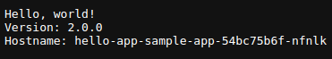

# Create and Deploy a Helm Chart on Kubernetes: Hello App with MySQL

### This guide demonstrates the deployment of a Helm chart for a "Hello App" along with MySQL as an external dependency. Please note that this Helm chart is kept minimal for demonstration purposes, without security measures.

<p align="center">

</p>


+ Steps: 

1. Use the following command to generate Helm chart files for your project, replacing _chartname_ with your desired chart name: ```helm create _chartname_```

2. edit/add the _values.yaml_ file:
    - image used: `gcr.io/google-samples/hello-app:2.0`
    - replicas: `1`
    - persistence:      # Configure persistence options:
        enabled: `false`
    - sshPublicKey: ""  # PubKey to be added
    - service:
        type: `LoadBalancer`
        port: `8080`  # The App is listening on port 8080

3. create _templates/configmap.yaml_ to store the SSH Key and add to _templates/deployment.yaml_ under container the env variable to make use of it.

4. _MySQL bitnami chart_ added as external dependency and deployed as single instance mysql pod (create requirments.yaml)

5. In the _templates/service.yaml_ directory, add an annotation to make the service persistent during uninstallation:
    - annotations:
        `helm.sh/resource-policy: keep`  # Add this line to prevent deletion

6. Add a pvc manifest file for the persistance storage option (see templates/pvc.yaml)

7. Package the Helm Chart: `helm package .`

8. Deploy the Chart: `helm install <release_name> ./hello-app.tgz`

9. Visit the _LoadBalancer IP_ on port 8080 in Browser


### _Please note that this guide provides a basic overview of deploying a Helm chart. In production environments, consider adding security measures and custom configurations as needed._